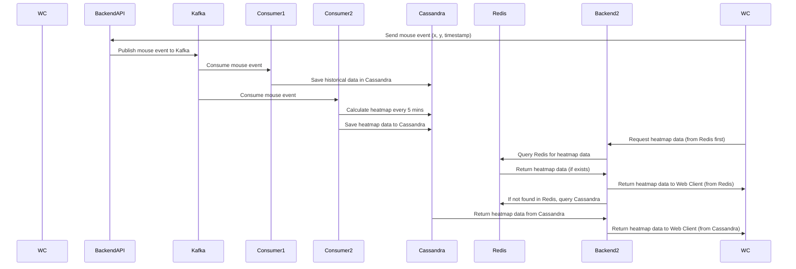

```mermaid
sequenceDiagram
    participant WebClient as WC
    participant BackendAPI as BackendAPI
    participant Kafka as Kafka
    participant Consumer1 as Consumer1
    participant Consumer2 as Consumer2
    participant Cassandra as Cassandra
    participant Redis as Redis
    participant Backend2 as Backend2

    %% Flow 1: Mouse Events & Heatmap Calculation
    WC->>BackendAPI: Send mouse event (x, y, timestamp)
    BackendAPI->>Kafka: Publish mouse event to Kafka

    Kafka->>Consumer1: Consume mouse event
    Consumer1->>Cassandra: Save historical data in Cassandra

    Kafka->>Consumer2: Consume mouse event
    Consumer2->>Cassandra: Calculate heatmap every 5 mins
    Consumer2->>Cassandra: Save heatmap data to Cassandra

    %% Flow 2: Viewing Heatmap Data
    WC->>Backend2: Request heatmap data (from Redis first)
    Backend2->>Redis: Query Redis for heatmap data
    Redis->>Backend2: Return heatmap data (if exists)
    Backend2->>WC: Return heatmap data to Web Client (from Redis)

    Backend2->>Redis: If not found in Redis, query Cassandra
    Cassandra->>Backend2: Return heatmap data from Cassandra
    Backend2->>WC: Return heatmap data to Web Client (from Cassandra)
```